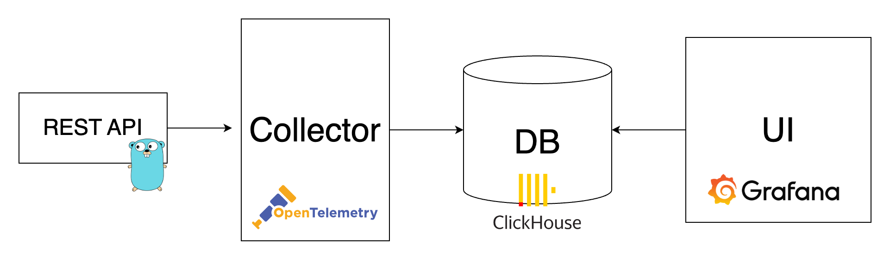

# DIY Monitoring with OSS

OTel 💛 ClickHouse 💛 Grafana

> This repository contains a demonstration setup for an observability stack using OpenTelemetry Collector (OTel Collector), ClickHouse, and Grafana. This stack is orchestrated with Docker Compose, making it easy to deploy and manage the components.

## Overview
The setup includes the following components:

- **OTel Collector**: Collects, processes, and exports telemetry data (metrics, logs, traces) to various backends. Configured to run with a custom configuration file.
- **ClickHouse**: A column-oriented database management system used for analytics and log management solutions.
- **Grafana**: An open-source platform for monitoring and observability. It's used here to visualize metrics and logs stored in ClickHouse.
- **Go Application**: A sample Go application to generate telemetry data.




## Prerequisites
- Docker and Docker Compose installed on your system.
- [Telemetrygen](https://github.com/open-telemetry/opentelemetry-collector-contrib/tree/main/cmd/telemetrygen)
- Basic understanding of observability (metrics, logs, traces) and Docker.

## Configuration
The `docker-compose.yml` file orchestrates the deployment of these services. Each service is configured as follows:

- **OTel Collector**: Custom configuration file mounted from `./otel/otelcol-config.yml.` Exposes ports for OTLP over gRPC and HTTP receivers, Prometheus exporter, and metrics endpoint.
- **ClickHouse**: Limits on open files set for performance. Exposes its native interface and HTTP interface on localhost.
- **Grafana**: Memory limit set and custom grafana.ini configuration file mounted. Grafana's provisioning directory is also mounted to automate datasource and dashboard configurations. The ClickHouse datasource plugin is installed by default.
- **Go Application**: A simple server application to generate telemetry data. Exposed on port 8080.
Usage

To get started, clone this repository and navigate to the directory containing `docker-compose.yml`. Run the following command to start the services:

```bash
docker-compose up -d
```

### Generate Telemetry Data

1. `telemetrygen` simulates a client generating traces, metrics, and logs. It is useful for testing and demonstration purposes. After installing this tool, you can generate telemetry data by running:

    ```bash
    # logs
    telemetrygen logs --duration 3s --body "Some log message" --otlp-insecure

    # metrics
    telemetrygen metrics --duration 3s  --metric-type Sum --otlp-insecure --otlp-attributes service=\"test\"

    # traces
    telemetrygen traces --duration 3s --otlp-insecure
    ```

2. You can also generate data using the sample Go application provided in this repository. The application exposes an HTTP server on port `8080`. To generate data, run:

    ```bash
    curl http://localhost:8080/rolldice
    curl http://localhost:8080/rolldice/slow
    curl http://localhost:8080/rolldice/error
    ```

    Or use `while` statement to generate massive data:

    ```bash
    while true; do
      curl http:localhost:8080/rolldice
      sleep 0.1
    done
    ```

> 🚨 For now, it only supports generating traces. You can extend it to generate metrics and logs as well.


### Accessing Grafana
After starting the services, Grafana will be accessible at `http://localhost:3000`.

### Visualizing Data
With the datasource configured, you can start creating dashboards to visualize data stored in ClickHouse. Sample queries and dashboard configurations can be found in the grafana/provisioning/dashboards directory.

### Customizing the Setup
- OTel Collector Configuration: Modify `otel/otelcol-config.yml` to adjust the telemetry data processing and export.
- Grafana Configuration: Adjust `grafana.ini` and the provisioning files in `./grafana/provisioning/` to customize Grafana's setup.
- ClickHouse and Go Application: These services are configured minimally for the demonstration. Modify their settings as needed for your use case.

### Cleanup
To stop and remove the containers, networks, and volumes, run:

```bash
docker-compose down
```

> Ctrl+C stops the containers, but `docker-compose down` is necessary to remove the volumes and networks created by Docker Compose.

## Contributing
We welcome contributions to improve this demo setup! Whether it's adding new features, improving documentation, or reporting issues, please feel free to contribute.

## Credits

This project draws inspiration and code from:

- [ClickHouse OpenTelemetry Demo](https://github.com/ClickHouse/opentelemetry-demo) for insights on integrating ClickHouse with OpenTelemetry Collector.
- [OpenTelemetry Demo](https://github.com/open-telemetry/opentelemetry-demo) for patterns in telemetry data collection and processing.

We thank the contributors of these projects for their valuable work.


## License
This project is open-sourced under the MIT License. See the LICENSE file for more details.
